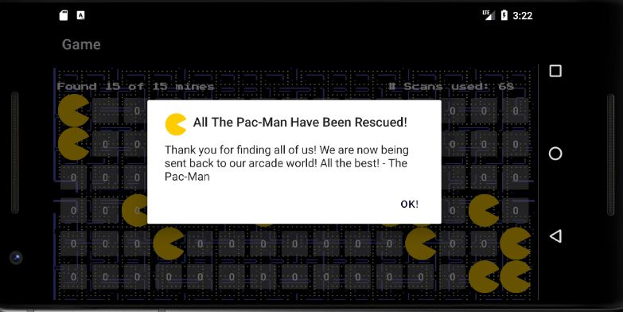

# AndroidPacmanSeeker

## Prerequisites
* Android Studio
* Android OS version 7.0 (API 24, Nougat) and newer

## Installation

### Install Android Studio
``` https://developer.android.com/studio ```

### Clone the repo
``` https://github.com/HarisAhmad16/AndroidPacmanSeeker.git ```

### Open Repo in Android Studio

### Run the app
``` Run with an emulator or an android device via connection to pc / laptop ```



